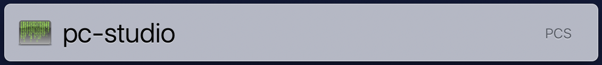
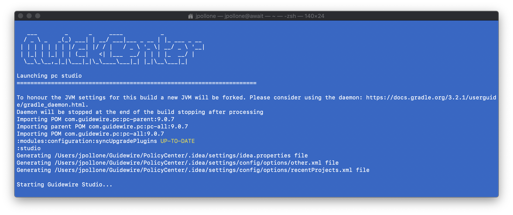

# App Launcher

> Launch applications and tasks with a few keystrokes!

1. Setup [Command Line](usage/command-line) apps/tasks. 

2. Install an app launcher, such as [LaunchBar (macOS)](https://www.obdev.at/products/launchbar/index.html) or [Listary (Windows)](https://www.listary.com/).

3. Add the script folder to the app launcher index.

4. Assign an abbreviation to an app and task. For example, to launch ```pc-studio```, assign ```pcs``` as the abbreviation.



5. Invoke the app launcher, type the abbreviation, and hit the return key. 

    In this example Launchbar is invoked with ```CMD-Space```. The abbreviation ```PCS``` is typed and the related action ```pc_studio``` is launched. 

